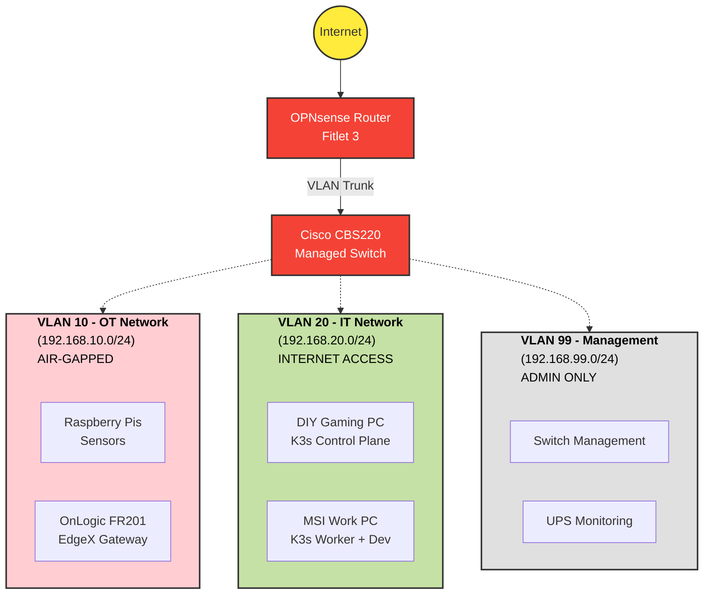

# IIoT Kubernetes Homelab

> Building a production-grade Industrial IoT homelab with Kubernetes, EdgeX Foundry, United Manufacturing Hub, and Ignition SCADA

[](https://kubernetes.io/)
[](https://github.com/edgexfoundry/edgex-go)
[](https://github.com/united-manufacturing-hub/united-manufacturing-hub)
[](https://boot.dev/)
[-blue)](docs/progress/bootdev-progress.md)

---

## Overview

This homelab replicates a real industrial IoT deployment architecture, combining cloud-native technologies with industrial automation platforms. The project demonstrates hands-on expertise in Kubernetes orchestration, IIoT data platforms, and OT/IT network segmentation.


### Goals

- **Learn Kubernetes & Docker** in a production-like environment
- **Deploy IIoT Platforms:** EdgeX Foundry, United Manufacturing Hub, Ignition 8.3
- **Practice OT/IT Network Segmentation** with VLANs and firewall rules
- **Develop Backend Skills:** Go microservices, industrial protocols (Modbus, MQTT, OPC UA)
- **Build Portfolio:** Demonstrate cloud-native + industrial domain expertise

### Skills Demonstrated

- Kubernetes orchestration (K3s)
- Container networking & storage
- Industrial protocols (Modbus, OPC UA, MQTT, Ethernet/IP)
- Network segmentation (VLANs, firewalls)
- Time-series databases (TimescaleDB)
- Real-time data streaming (Kafka, MQTT)
- ISA 101 compliant HMI design
- Go backend development

---

## Architecture

### High-Level Overview



### Network Segmentation

| VLAN | Network | Purpose | Devices |
|------|---------|---------|---------|
| 10 | 192.168.10.0/24 | OT Network ("Factory Floor") | Raspberry Pis, EdgeX Gateway, Sensors |
| 20 | 192.168.20.0/24 | IT Network ("Data Center") | Kubernetes cluster, development workstation |
| 99 | 192.168.99.0/24 | Management | Switch management, UPS monitoring |

**Firewall Strategy:**
- OT → IT: Allow MQTT (1883), OPC UA (4840), HTTP/S (80, 443)
- IT → OT: Allow all (management/monitoring)
- OT → Internet: DENY (air-gapped)
- IT → Internet: ALLOW

---

## Hardware

**Total Cost:** ~$600 CAD

### Core Infrastructure

| Component | Specifications | Role | Approx. Cost (CAD) |
|-----------|---------------|------|--------------------|
| **Fitlet 3** | Intel Atom x6425E, 8GB RAM, 500GB NVMe | OPNsense Router/Firewall | Owned |
| **Cisco CBS220-16T-2G** | 16-port managed switch | VLAN switching | $171 |
| **Netgear Orbi RBK13** | Mesh WiFi (RBR10 + 2x RBS10) | WiFi Access Points | Owned |

### Compute Nodes

| Component | Specifications | Role | Cost |
|-----------|---------------|------|------|
| **DIY Gaming PC** | Ryzen 5 3600X, 16GB RAM, 1TB NVMe | K3s Control Plane | Owned |
| **MSI Work PC** | Ryzen 5 5600G, 32GB RAM, 250GB SSD | K3s Worker + Daily Driver | Owned |
| **OnLogic FR201** | Pi CM4 (4GB), 128GB eMMC | EdgeX Gateway | Owned |
| **2x Raspberry Pi 4B** | 4GB RAM each | K3s Edge Workers | ~$230 |

See [hardware/hardware-list.md](hardware/hardware-list.md) for detailed specifications.

---

## Technologies

### Kubernetes Platform
- **K3s** (v1.28+) - Lightweight Kubernetes
- **Longhorn** - Distributed storage
- **MetalLB** - Load balancer
- **Flannel CNI** - Networking

### IIoT Platforms
- **United Manufacturing Hub** (v0.43.8+) - MQTT, Kafka, TimescaleDB, Grafana
- **EdgeX Foundry** (v4.0+) - Edge computing framework
- **Ignition** (v8.3) - SCADA platform (Maker Edition)

### Protocols & Integration
- **Modbus TCP/RTU** - Industrial device communication
- **MQTT** (v3.1.1 / v5.0) - Message broker
  - **Sparkplug B** Communication framework built on top of MQTT 
- **OPC UA** - Industrial interoperability
- **HTTP/REST** - API communication

### Backend Development
- **Go** (1.21+) - Microservice development
- **Docker** - Containerization
- **GitHub Actions** - CI/CD (planned)

---

## Project Progress

| Phase | Status | Description |
|-------|--------|-------------|
| **Phase 0: Hardware Prep** | Complete | Hardware acquired and assembled |
| **Phase 1: Network Foundation** | Complete | OPNsense + VLANs configured |
| **Phase 2: Kubernetes Cluster** | In Progress | K3s deployment |
| **Phase 3: Storage & LoadBalancing** | Planned | Longhorn + MetalLB |
| **Phase 4: UMH Deployment** | Planned | MQTT, Kafka, TimescaleDB, Grafana |
| **Phase 5: EdgeX Gateway** | Planned | Edge data collection |
| **Phase 6: Edge Devices** | Planned | Raspberry Pi sensors |
| **Phase 7: Ignition & Remote Access** | Planned | SCADA HMI + Tailscale VPN |

### Current Milestones

- [x] OPNsense WAN connectivity
- [x] Orbi WiFi mesh in AP mode
- [x] VLAN segmentation (OT/IT/Management)
- [x] Cisco switch configuration
- [x] Arch Linux installed on Business PC
- [ ] K3s control plane setup
- [ ] K3s worker nodes joined
- [ ] Longhorn storage deployment
- [ ] UMH platform deployment

---

## Blog Series

Follow the weekly build series documenting the journey at [aott33.github.io](https://aott33.github.io):

**Published Posts:**
- [Laying the Foundation - Homelab - Week 1](https://aott33.github.io/posts/week-01-router-config/)
- [What the Heck are VLANs? - Homelab - Week 2](https://aott33.github.io/posts/week-02-switch-config/)
- [Arch Linux Install: What Could Go Wrong? - Homelab - Week 3](https://aott33.github.io/posts/week-03-arch-linux-install/)

**Topics Covered:**
- Week 1: OPNsense Router Setup
- Week 2: VLAN Segmentation for Industrial Security
- Week 3-4: Kubernetes Cluster Setup
- Week 5-6: Storage & Edge Computing
- Week 7-12: IIoT Platform Deployment
- Week 13-16: Integration, Security, Custom Development

---

## Repository Structure

```
iiot-kubernetes-homelab/
├── README.md                   # This file
├── hardware/                   # Hardware specifications
│   ├── hardware-list.md       # Detailed inventory
│   └── network-topology.md    # Network diagrams
├── kubernetes/                 # K8s manifests
│   ├── base/
│   ├── umh/
│   ├── edgex/
│   ├── ignition/
│   └── monitoring/
├── services/                   # Custom Go services
│   └── homelab-status/
├── scripts/                    # Utility scripts
└── docs/                       # Additional documentation
    └── architecture.md        # Detailed architecture
```

---

## Resources

### Official Documentation
- [K3s Documentation](https://docs.k3s.io/)
- [United Manufacturing Hub](https://umh.docs.umh.app/)
- [EdgeX Foundry](https://docs.edgexfoundry.org/)
- [OPNsense Documentation](https://docs.opnsense.org/)
- [Ignition Documentation](https://docs.inductiveautomation.com/)
- [Tailscale Documentation](https://tailscale.com/kb/)

### Learning Resources
- [Boot.dev](https://boot.dev/) - Backend Developer Pathway (Python and Golang)
- [ISA 101 HMI Standards](https://www.isa.org/)
- [Kubernetes Patterns](https://kubernetes.io/docs/concepts/)

### Related Projects
- [Pump Station Modbus Simulator](https://github.com/aott33/pump-station-modbus-sim) - Testing industrial protocols

---

## Getting Started

### Initial Setup

```bash
# Clone the repository
git clone https://github.com/aott33/iiot-kubernetes-homelab.git
cd iiot-kubernetes-homelab

# Explore documentation
cat README.md                          # Project overview
cat hardware/hardware-list.md          # Hardware specs
cat hardware/network-topology.md       # Network design
cat docs/architecture.md               # System architecture
```

---

**Built by:** Andrew Ott
**Purpose:** Demonstrating cloud-native backend engineering skills with industrial IoT domain expertise
**Status:** Active Development (Week 2 of 16)

For questions or collaboration, connect via [GitHub](https://github.com/aott33) or [LinkedIn](https://www.linkedin.com/in/andrewott33/)
