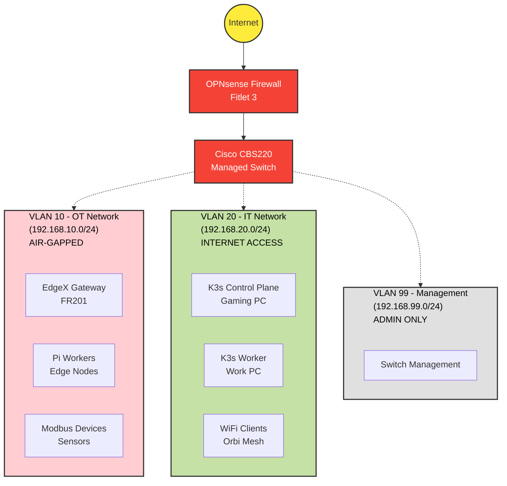
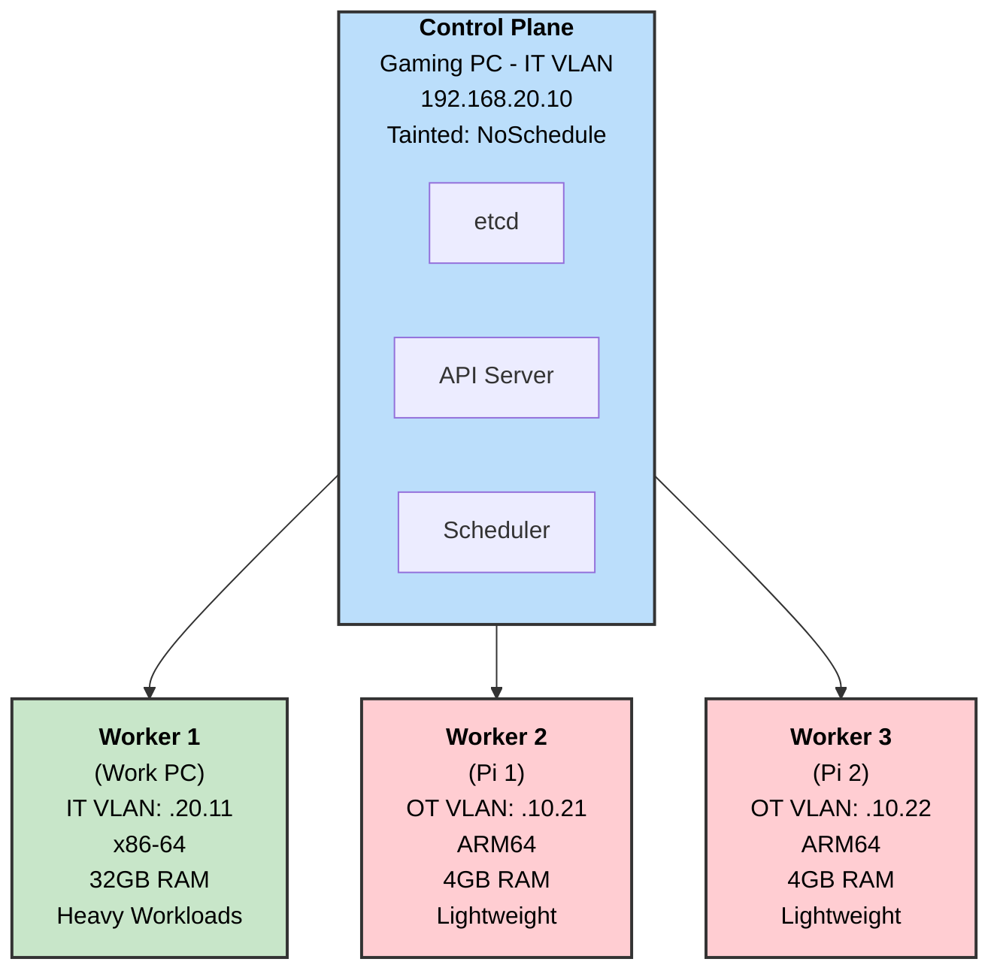
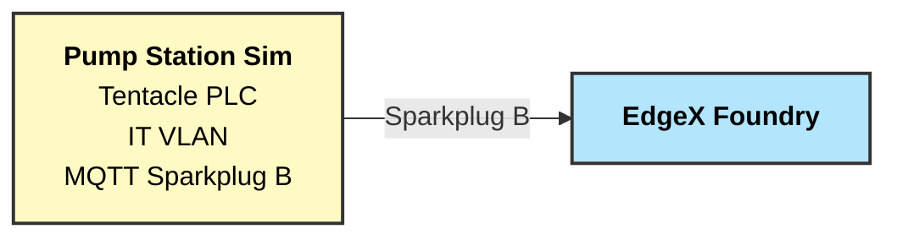
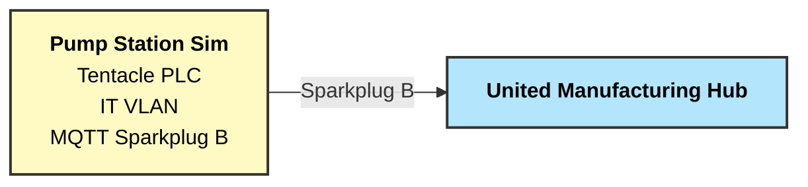
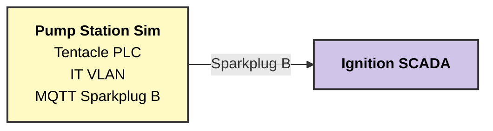
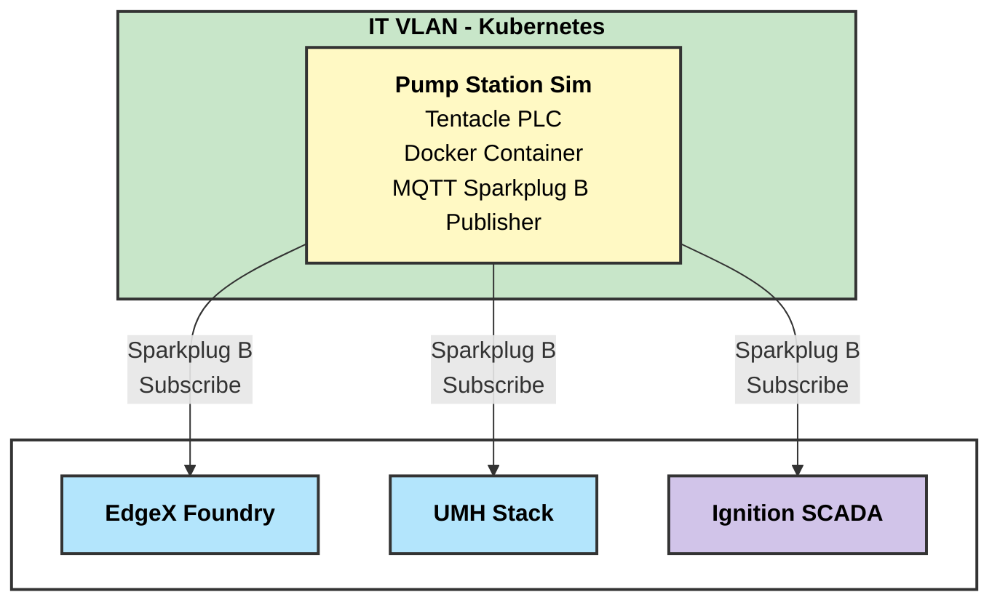
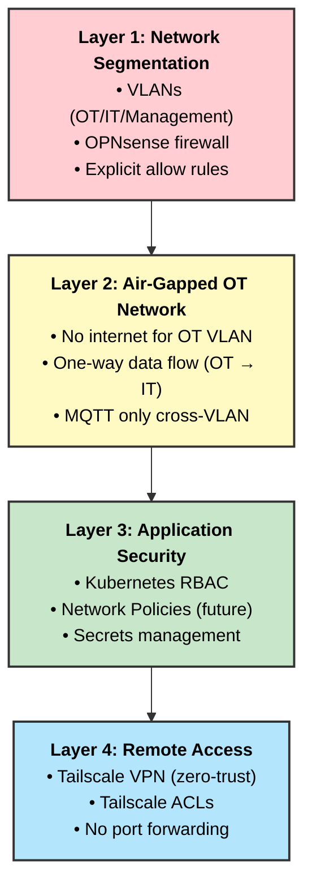

# IIoT Kubernetes Homelab - Architecture

**Last Updated:** November 11, 2025

---

## Table of Contents

1. [System Overview](#system-overview)
2. [Network Architecture](#network-architecture)
3. [Kubernetes Architecture](#kubernetes-architecture)
4. [Data Flow Architecture](#data-flow-architecture)
5. [Platform Integration](#platform-integration)
6. [Security Architecture](#security-architecture)

---

## System Overview

This homelab implements a production-grade Industrial IoT architecture with clear separation between Operational Technology (OT) and Information Technology (IT) networks, following industrial cybersecurity best practices.

### Design Principles

1. **OT/IT Segmentation:** Physical and logical separation between factory floor (OT) and enterprise (IT) networks
2. **Defense in Depth:** Multiple layers of security (firewall, VLANs, air-gapping, VPN)
3. **Cloud-Native Infrastructure:** Kubernetes-based platform for scalability and resilience
4. **Protocol Translation:** EdgeX Foundry bridges industrial protocols to modern APIs
5. **Data Pipeline:** Structured flow from sensors → edge → cloud-native data platform

---

## Network Architecture

### Three-VLAN Design



### VLAN Details

| VLAN | Purpose | Internet | Cross-VLAN | Use Case |
|------|---------|----------|-----------|----------|
| **10 (OT)** | Factory floor devices | Denied | → IT only | EdgeX, sensors, Pi edge workers |
| **20 (IT)** | Enterprise network | Allowed | → All | K3s cluster, workstations, WiFi |
| **99 (Mgmt)** | Infrastructure | Allowed | ← IT only | Switch management, UPS |

---

## Kubernetes Architecture

### Cluster Topology



### Workload Distribution

| Node | VLAN | Resources | Workloads | Notes |
|------|------|-----------|-----------|-------|
| **Gaming PC** | IT | 16GB RAM, 6 cores | Control plane only | Tainted NoSchedule |
| **Work PC** | IT | 32GB RAM, 6 cores | UMH, Ignition, heavy pods | Resource limits: 10GB for K8s |
| **Pi 1** | OT | 4GB RAM, 4 cores | EdgeX (Docker), lightweight | ARM64 workloads |
| **Pi 2** | OT | 4GB RAM, 4 cores | Edge services, monitoring | ARM64 workloads |

### Cross-VLAN Networking

**Challenge:** K3s cluster spans IT and OT VLANs

**Solution:** Firewall rules allow Kubernetes control traffic:

| Port | Protocol | Direction | Purpose |
|------|----------|-----------|---------|
| 6443 | TCP | OT → IT | Kubernetes API server |
| 10250 | TCP | Bidirectional | Kubelet API |
| 8472 | UDP | Bidirectional | Flannel VXLAN overlay |

---

## Data Flow Architecture

### Platform Testing Strategy

This homelab is designed to test **three independent IIoT platforms** end-to-end:

1. **EdgeX Foundry** - Edge computing framework
2. **United Manufacturing Hub (UMH)** - Cloud-native IIoT data platform
3. **Ignition SCADA** - Traditional SCADA/HMI platform

**Data Source:** All platforms will connect to the **Pump Station Sim** (Docker container running in IT VLAN) using **Tentacle PLC** with **Sparkplug B** MQTT protocol. All PLC variables are available via MQTT Sparkplug B by default.

**Note:** Detailed platform architectures and integration patterns will be confirmed during development phases.

### EdgeX Foundry Pipeline (Simplified)



**Goal:** Test EdgeX integration with Sparkplug B protocol and build custom visualizations.

### United Manufacturing Hub Pipeline (Simplified)



**Goal:** Test UMH integration with Sparkplug B and build data pipeline with Grafana dashboards.

### Ignition SCADA Pipeline (Simplified)



**Goal:** Test Ignition Sparkplug module and build ISA 101 compliant HMI screens.

### Integration Approach

**Current Phase:** Independent platform evaluation with shared Pump Station Sim

- Single Pump Station Sim (Docker container, IT VLAN)
- Tentacle PLC provides MQTT Sparkplug B interface
- Each platform subscribes to Sparkplug topics
- Platform-specific integration and visualization development

**Future Phase:** Potential cross-platform integration if beneficial

---

## Platform Integration

### Current Architecture: Shared Data Source

All platforms connect to a single Pump Station Sim via Sparkplug B:



### Technology Stack (Per Platform)

**Pump Station Sim (Shared):**
| Component | Technology | Purpose |
|-----------|-----------|---------|
| PLC Runtime | Tentacle PLC | Soft PLC with Modbus device integration |
| MQTT Publisher | Sparkplug B | Publishes all PLC variables to MQTT broker |
| Deployment | Docker | Container in IT VLAN (K8s or standalone) |

**EdgeX Foundry:**
| Component | Technology | Purpose |
|-----------|-----------|---------|
| Sparkplug Subscriber | EdgeX Device Service | Consumes Sparkplug B topics |
| Visualization | TBD | Custom dashboards (architecture to be confirmed) |

**United Manufacturing Hub:**
| Component | Technology | Purpose |
|-----------|-----------|---------|
| Sparkplug Subscriber | UMH MQTT Broker | Native Sparkplug B support |
| Data Pipeline | Kafka → TimescaleDB | Event streaming and storage |
| Visualization | Grafana | Time-series dashboards |

**Ignition SCADA:**
| Component | Technology | Purpose |
|-----------|-----------|---------|
| Sparkplug Module | Ignition Engine | Native Sparkplug B client |
| Tag Provider | Ignition Tags | Maps Sparkplug metrics to tags |
| Visualization | Perspective HMI | ISA 101 compliant screens |

**Note:** Detailed architectures for each platform will be designed during their respective development phases.

---

## Security Architecture

### Defense in Depth



### Firewall Rules Summary

**OPNsense LAN Rules (high-level):**

```
[IT VLAN → Internet]     ALLOW ALL
[IT VLAN → OT VLAN]      ALLOW ALL (management access)
[OT VLAN → IT VLAN]      ALLOW MQTT (1883), OPC UA (4840), K3s (6443, 10250, 8472)
[OT VLAN → Internet]     DENY (air-gapped)
[Management → Internet]  ALLOW (firmware updates)
[IT → Management]        ALLOW (admin access)
[OT → Management]        DENY
```

---

## Technology Stack Summary

| Layer | Technology | Purpose |
|-------|-----------|---------|
| **Network** | OPNsense, Cisco CBS220, VLANs | Segmentation, routing, firewall |
| **Orchestration** | K3s (Kubernetes) | Container orchestration |
| **Storage** | Longhorn | Distributed persistent storage |
| **Load Balancing** | MetalLB | External service IPs |
| **Data Source** | Pump Station Sim + Tentacle PLC | Soft PLC with Sparkplug B MQTT publisher |
| **Edge Gateway** | EdgeX Foundry | Sparkplug B integration, edge processing |
| **Data Platform** | United Manufacturing Hub | MQTT, Kafka, TimescaleDB, Grafana |
| **SCADA** | Ignition 8.3 | Sparkplug B client, ISA 101 HMI |
| **VPN** | Tailscale | Secure remote access |
| **Backend** | Go microservices | Custom development |

---

## Future Architecture Enhancements

### Planned Additions

1. **High Availability:**
   - Multi-master K3s control plane
   - Database replication (TimescaleDB HA)

2. **Observability:**
   - Prometheus + Grafana for infrastructure metrics
   - Distributed tracing (Jaeger/Tempo)
   - Centralized logging (Loki)

3. **Network Policies:**
   - Kubernetes Network Policies (Calico or Cilium)
   - Micro-segmentation within cluster

4. **GitOps:**
   - ArgoCD for declarative deployments
   - FluxCD alternative

5. **Additional Protocols:**
   - OPC UA server/client
   - Ethernet/IP integration
   - Profinet (if hardware supports)

---

## Related Documentation

- [Network Topology Details](../hardware/network-topology.md)
- [Hardware Specifications](../hardware/hardware-list.md)
- [Main README](../README.md)
