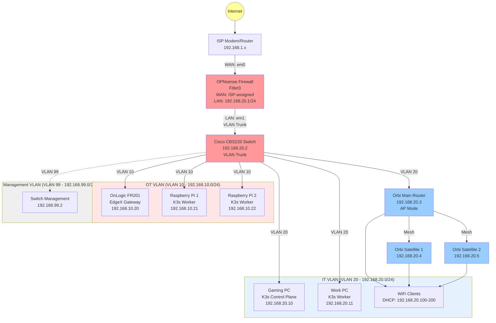

# Network Topology

**Last Updated:** November 11, 2025
**Status:** Week 2 - VLANs Implemented

---

## Network Diagram



---

## VLAN Design

### VLAN 10 - OT Network (Operational Technology)

**Purpose:** Industrial "factory floor" network (air-gapped from internet)

**Network:** 192.168.10.0/24
**Gateway:** 192.168.10.1 (OPNsense)
**DHCP Range:** 192.168.10.100 - 192.168.10.200
**DNS:** 192.168.10.1 (OPNsense resolver)

**Devices:**
| Device | IP Address | Purpose |
|--------|------------|---------|
| OnLogic FR201 | 192.168.10.20 | EdgeX Foundry gateway |
| Raspberry Pi 1 | 192.168.10.21 | K3s worker (edge) |
| Raspberry Pi 2 | 192.168.10.22 | K3s worker (edge) |
| Modbus Simulator | 192.168.10.50 | Testing industrial protocols |

**Firewall Rules (OPN sense):**
- **OT → Internet:** DENY (air-gapped for security)
- **OT → IT VLAN:** ALLOW MQTT (1883), OPC UA (4840), HTTP/S (80, 443), K3s (6443, 10250)
- **IT → OT:** ALLOW ALL (management access)

---

### VLAN 20 - IT Network (Information Technology)

**Purpose:** Personal devices, development workstations, Kubernetes cluster

**Network:** 192.168.20.0/24
**Gateway:** 192.168.20.1 (OPNsense)
**DHCP Range:** 192.168.20.100 - 192.168.20.200
**DNS:** 8.8.8.8, 8.8.4.4 (via OPNsense)

**Static Assignments:**
| Device | IP Address | Purpose |
|--------|------------|---------|
| OPNsense LAN | 192.168.20.1 | Gateway, DHCP, DNS |
| Cisco Switch | 192.168.20.2 | Switch management |
| Orbi Main | 192.168.20.3 | WiFi AP |
| Orbi Satellite 1 | 192.168.20.4 | WiFi mesh node |
| Orbi Satellite 2 | 192.168.20.5 | WiFi mesh node |
| Gaming PC (K3s) | 192.168.20.10 | K3s control plane |
| Work PC (K3s) | 192.168.20.11 | K3s worker + daily use |

**Firewall Rules:**
- **IT → Internet:** ALLOW ALL
- **IT → OT VLAN:** ALLOW ALL (for management)
- **IT → Management VLAN:** ALLOW ALL

---

### VLAN 99 - Management Network

**Purpose:** Infrastructure management (switch, UPS monitoring)

**Network:** 192.168.99.0/24
**Gateway:** 192.168.99.1 (OPNsense)
**DHCP Range:** 192.168.99.100 - 192.168.99.200

**Static Assignments:**
| Device | IP Address | Purpose |
|--------|------------|---------|
| Cisco Switch Mgmt | 192.168.99.2 | Switch web UI/CLI |
| UPS (future) | 192.168.99.10 | UPS monitoring |

**Firewall Rules:**
- **Management → Internet:** ALLOW (for firmware updates)
- **IT → Management:** ALLOW (admin access)
- **OT → Management:** DENY

---

## Physical Network Layout

### Cisco CBS220 Switch Port Assignments

| Port | VLAN | Device | Notes |
|------|------|--------|-------|
| 1-6 | 10 (OT) | OT devices | EdgeX, Raspberry Pis, sensors |
| 7-12 | 20 (IT) | IT devices | Gaming PC, Work PC, Orbi |
| 13 | 99 (Mgmt) | Switch management | Switch management interface |
| 14-15 | 20 (IT) | Reserved | Future IT devices |
| 16 | Trunk (All) | OPNsense LAN | 802.1Q trunk port |

**Trunk Port Configuration (Port 16):**
- Tagged VLANs: 10, 20, 99
- Native VLAN: 20 (IT)
- Connects to OPNsense LAN interface (em1)

---

## OPNsense Interface Configuration

### Physical Interfaces

| Interface | Name | Description | MAC Address |
|-----------|------|-------------|-------------|
| **em0** | WAN | ISP connection | (Hardware) |
| **em1** | LAN | VLAN trunk to switch | (Hardware) |

### VLAN Interfaces

| VLAN ID | Interface | IP Address | DHCP Server | Description |
|---------|-----------|------------|-------------|-------------|
| 20 | LAN | 192.168.20.1/24 | Yes (100-200) | IT Network (default) |
| 10 | VLAN_OT | 192.168.10.1/24 | Yes (100-200) | OT Network |
| 99 | VLAN_MGMT | 192.168.99.1/24 | Yes (100-200) | Management Network |

---

## Kubernetes Cluster Networking

### Cross-VLAN K3s Cluster

**Challenge:** K3s cluster spans IT VLAN (control plane) and OT VLAN (edge workers)

**Solution:** Firewall rules allow K3s control plane communication across VLANs

**Required Ports (OT → IT):**
| Port | Protocol | Purpose |
|------|----------|---------|
| 6443 | TCP | Kubernetes API server |
| 10250 | TCP | Kubelet API |
| 8472 | UDP | Flannel VXLAN overlay |

**Cluster Architecture:**
```
Control Plane (Gaming PC - IT VLAN)
         ↓
    ┌────┴────┐
    │         │
Worker 1    Worker 2    Worker 3
(Work PC)   (Pi 1)      (Pi 2)
IT VLAN     OT VLAN     OT VLAN
```

---

## Data Flow Examples

### Industrial Data Pipeline

```
Modbus Simulator (OT VLAN)
    ↓ Modbus TCP
EdgeX Device Service (OT VLAN)
    ↓ MQTT (port 1883, OT → IT)
UMH MQTT Broker (IT VLAN - K3s)
    ↓ Kafka
TimescaleDB (IT VLAN - K3s)
    ↓ SQL queries
Grafana (IT VLAN - K3s)
```

**Firewall Rule Required:** OT VLAN → IT VLAN port 1883 (MQTT)

---

### Remote Access (Tailscale)

```
Laptop (Remote Location)
    ↓ Tailscale VPN
OPNsense (Subnet Router)
    ↓ Routes to VLANs
192.168.10.0/24 (OT)
192.168.20.0/24 (IT)
192.168.99.0/24 (Management)
```

**Tailscale ACLs enforce network segmentation even for remote users**

---

## DNS Configuration

### OPNsense DNS Resolver (Unbound)

**IT VLAN DNS:**
- Upstream: 8.8.8.8, 8.8.4.4 (Google DNS)
- Local domain: homelab.local
- DNSSEC: Enabled

**OT VLAN DNS:**
- Upstream: 192.168.20.1 (OPNsense resolver)
- No direct internet DNS (air-gapped)
- Local domain resolution only

---

## Network Performance

### Current Bottlenecks

**WiFi Speed:** Orbi RBR10/RBS10 limited to ~150 Mbps over WiFi (802.11ac Wave 1)
**Wired Speed:** Full ~900 Mbps via Ethernet to switch and OPNsense

### Bandwidth Allocation

| VLAN | Expected Usage | Priority |
|------|----------------|----------|
| IT (20) | High (video streaming, downloads, K3s) | Normal |
| OT (10) | Low (IIoT data, MQTT, Modbus) | High (QoS) |
| Management (99) | Very Low (switch management) | Low |

**QoS Configuration (Future):** Prioritize OT VLAN traffic for industrial data reliability

---

## Future Enhancements

### Planned Upgrades

1. **WiFi 6 Access Point**
   - Replace Orbi with Grandstream GWN7660E (~$150 CAD)
   - Full ~900 Mbps WiFi speed
   - Multiple SSIDs per VLAN

2. **UPS Integration**
   - CyberPower CP1500PFCRM2U rack-mount UPS
   - SNMP monitoring in Management VLAN

3. **Additional OT Devices**
   - More Raspberry Pi sensors
   - Modbus RTU devices via USB-to-RS485

4. **Monitoring & Logging**
   - Prometheus + Grafana for network metrics
   - Centralized syslog server

---

## Troubleshooting

### Common Issues

**Problem:** Devices can't ping across VLANs
- Check OPNsense firewall rules (LAN rules → allow inter-VLAN)
- Verify switch VLAN tagging on trunk port
- Check device gateway is correct VLAN IP

**Problem:** K3s workers in OT VLAN can't join cluster
- Verify ports 6443, 10250, 8472 allowed (OT → IT)
- Check Flannel VXLAN overlay (8472/UDP)
- Test connectivity: `nc -zv 192.168.20.10 6443`

**Problem:** No internet in OT VLAN
- Expected behavior (air-gapped by design)
- If needed temporarily, add firewall rule: OT → WAN allow

---

## Security Considerations

### Air-Gapped OT Network

**Rationale:** Industrial best practice - prevent malware/ransomware from internet reaching OT devices

**Exceptions:** Controlled data flows via MQTT/OPC UA to IT VLAN (one-way where possible)

### Firewall Philosophy

- **Default Deny:** All inter-VLAN traffic blocked by default
- **Explicit Allow:** Only required ports/protocols allowed
- **Logging:** All firewall rule matches logged for audit

---

## Related Documentation

- [Hardware Inventory](hardware-list.md)
- [Architecture Overview](../docs/architecture.md)
- [Week 01: OPNsense Setup](../docs/setup/week-01-opnsense-wifi.md) (future)
- [Week 02: VLAN Configuration](../docs/setup/week-02-vlan-switch.md) (future)
